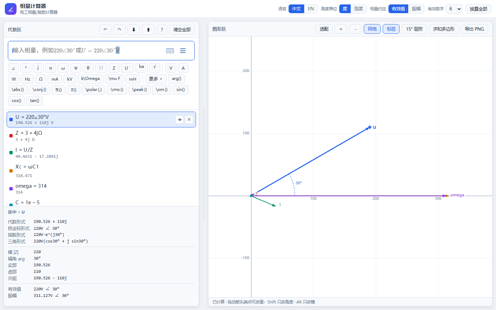

# Phasor Lab · 相量计算器

A phasor / complex-number calculator built for AC circuit analysis, with a
GeoGebra-style two-pane layout and a **live phasor diagram**.
Ordinary calculators cannot even type phasor notation; this one is built around it.

一个为**交流电路分析**而生的相量与复数计算器，采用 GeoGebra 风格双栏界面，右侧**实时绘制相量图**。
普通计算器连相量记号都打不出来，这个工具就是围绕它设计的。



---

## Why another calculator

* **Type phasors the way textbooks write them** — `220\angle 30\degree`, `3+4j`,
  `220e^{j30\degree}`, `5(\cos 53\degree + j\sin 53\degree)`.
* **Name things** — `U=220\angle 30\degree\text{V}`, then `I=U/Z`.
  Subscripts work: `U_1`, `X_{L}`.
* **See it** — every visible object is drawn as an arrow; phase angles get an arc
  marker; drag an arrow tip to change the value.
* **Get the numbers you need** — modulus, argument, real part, imaginary part,
  conjugate, both RMS and amplitude forms.

## Features

| | |
| --- | --- |
| Four input forms | polar, rectangular, exponential, trigonometric (mix them freely in one expression) |
| Named variables | definitions resolve in **any order** — `I=U/Z` may come before `U` and `Z` |
| Functions | `\abs \arg \conj \Re \Im \polar \rms \peak \om` plus `sin cos tan asin atan2` and friends |
| Live diagram | grid, axes, coloured arrows, labels, phase-angle arc, optional sum polygon, PNG export |
| Direct manipulation | drag a tip to edit the phasor, wheel to zoom, drag the background to pan, double-click to fit |
| Edit again | double-click an object to load its own source back into the input box |
| Recall input | press ↑ in an empty input box to walk back through what you typed before |
| Copy a result | click any line of the result card to put that number on the clipboard |
| Compare two quantities | pick A and B: `A/B` is the impedance when A is a voltage and B a current, `A·conj(B)` is the complex power, plus Δφ and cos Δφ |
| Worked examples | five classic setups (series RLC, power factor, three-phase star, parallel branches, a KVL loop) load with one click |
| Undo / redo | every change, including settings, angle-unit switches and the convention conversion |
| Never lose work | the project is saved in the browser as you type, and can be exported / imported as JSON |
| Angle units | degrees (default) or radians, switchable at any time |
| Phasor convention | RMS (default) or amplitude, with an explicit *convert all* action |
| Bilingual UI | 中文 / English, switchable at runtime |
| Engine | [mathjs](https://mathjs.org) for evaluation, [MathLive](https://mathlive.io) for input |

### Drag to edit

Drag the tip of an arrow to set a new value. `Shift` keeps the magnitude and only
changes the angle, `Alt` keeps the angle and only changes the magnitude, and the
**15° snap** toggle rounds the angle to a multiple of 15°.
The object's expression is rewritten to match, in the same form you typed it.

### Sums, KVL and KCL

Turn on **sum** in the graphics toolbar and the visible phasors are also drawn
head-to-tail, with the resultant labelled `Σ = …`. That single picture covers
both laws:

- **KVL** — around a loop the drops add up to the source. Load the *Series loop
  KVL* example: `U_R = 60∠0°`, `U_L = 80∠90°`, `U_C = 40∠−90°`, and the chain
  closes on `U = 60 + 40j = 72.11∠33.69°`.
- **KCL** — at a node the currents sum to zero, so hide everything except the
  branch currents and the resultant should land on the origin.

## Quick start

**On Windows, just double-click `start.bat`.** It installs the dependencies and
builds the app the first time (that needs the network once), then serves it at
http://localhost:4173/ and opens your browser. Keep its window open while you
use the app; `start.bat build` forces a rebuild after you change the code.

By hand, the app is a static site — everything under `dist/` is the whole program:

```bash
npm install
npm run dev        # development server
npm run build      # type-check + production bundle into dist/
npm run preview    # serve the built bundle
npm test           # unit tests
```

Then open the printed URL.

## Syntax reference

| What | How to type it |
| --- | --- |
| Polar | `220\angle 30\degree` or `220\angle 30` (bare number = current angle unit) |
| Rectangular | `3+4j` |
| Exponential | `220e^{j30\degree}` |
| Trigonometric | `5(\cos 53\degree + j\sin 53\degree)` |
| Definition | `U=220\angle 0\degree\text{V}` — the trailing unit is a display label |
| Several at once | `U=10;Z=2;I=U/Z` |
| Modulus / argument | `\abs(Z)`, `\arg(Z)` |
| Conjugate | `\overline{Z}` or `\conj(Z)` |
| Any phasor from parts | `\polar(220, 30)` |
| Angle of a ratio | `\atan2(y, x)` |
| Amplitude ⇄ RMS | `\peak(x)`, `\rms(x)` |
| Angular frequency | `\om(50)` = 314.16 |

A trailing `\text{...}` group is a **display label**, not part of the number:
`U=220\angle 0\degree\text{V}` shows as 220 V. Any label works (`\text{\Omega}`,
`\text{k\Omega}`, `\text{\mu F}`, or something entirely your own), and it never
affects the arithmetic.

### The angle model

Three rules, and everything else follows:

1. Expressions are evaluated in **radians** internally.
2. A **bare number in an angle position** (`220\angle 30`, `\sin 30`) is read in
   the current angle-unit setting; the `°` sign always means degrees.
3. **Angle-valued results** (`\arg`, `\asin`, `\atan`, …) come back in the current
   angle unit, so they compose with bare values — `\phi = \arg(Z)` followed by
   `220\angle \phi` does what you expect in either unit.

Changing the angle unit re-reads every stored expression, so `220\angle 30` really
does change meaning between degree and radian mode (that is the point).

### Names

A run of letters is a product of single-letter variables (`abc` = a·b·c), except
for known function words (`abs`, `arg`, `conj`, …) and known constants
(`pi`, `e`, `i`, `j`, plus Greek names like `omega`). `U_1` and `X_{L}` are single
symbols.

## Verification

`npm test` runs 201 unit tests: the LaTeX converter, the whole documented syntax
table (four input forms, the angle model, naming, unit labels, the convention
factor and twelve rejected inputs), the session model including undo/redo and
project round-trips, the diagram geometry, the two-phasor comparison, and every
shipped example (which is evaluated and compared against the textbook answer).
The UI itself is checked in a real browser: a headless-Chrome harness drives the
page through its public handle, asserts on computation results and DOM state,
samples canvas pixels to confirm the arrow and the sum polygon are drawn where
they should be, and exercises drag-to-edit, zoom, pan, hide/delete, undo/redo,
input recall, copy-to-clipboard, the example picker, the comparison card, the
help dialog, a phone-width layout, reload persistence and project export/import
(46 checks).

## Browser support

Any current Chromium, Firefox or WebKit build. MathLive ships its own fonts, so
no network access is required at runtime.

## License

MIT — see [LICENSE](LICENSE).

Bundled third-party software: [mathjs](https://mathjs.org) (Apache-2.0),
[MathLive](https://mathlive.io) (MIT), [KaTeX fonts](https://katex.org) (MIT).
